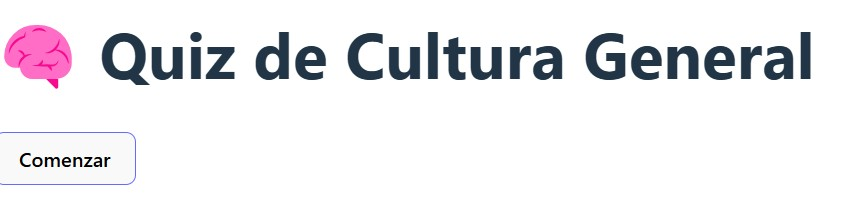
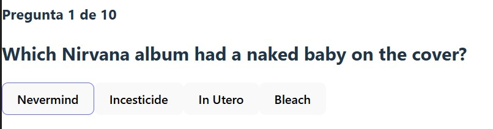
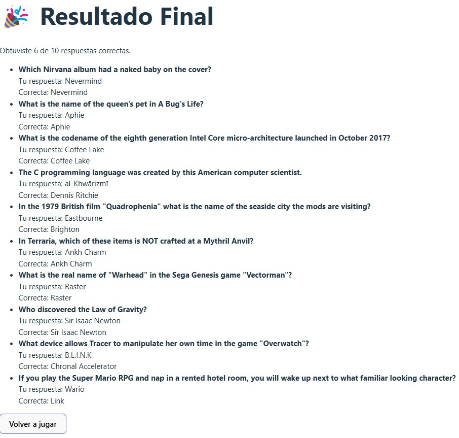

# 🧠 Quiz de Cultura General

Una aplicación web interactiva para poner a prueba tus conocimientos en diversas áreas del saber. Construida con React + TypeScript, consume datos en tiempo real desde la API de Open Trivia DB.

---

## 🚀 Características

- ✅ Preguntas aleatorias desde API REST
- ✅ Múltiples categorías, niveles de dificultad y cantidad de preguntas
- ✅ Feedback visual inmediato sobre las respuestas
- ✅ Puntuación final y revisión de preguntas
- ✅ Estado global con Zustand
- ✅ Tipado fuerte con TypeScript
- ✅ Estilos responsive y UI amigable

---

## 🛠️ Tecnologías utilizadas

- React
- TypeScript
- Vite
- Zustand
- React Router
- Open Trivia DB (fuente de preguntas)

---

## 📸 Capturas de pantalla

| Inicio | Pregunta en curso | Resultados |
|--------|-------------------|------------|
| |  |  |

---

## ⚙️ Instalación local

1. Clonar repositorio:
```bash
  git clone https://github.com/EstebanKuh/general-quiz-app.git cd quiz-app
```

2. Instalar las dependencias:
```bash
  npm install
```

3. Iniciar la app:
```bash
  npm run dev
```

Abrir el navegador y poner la siguiente dirección url http://localhost:5173 para ver la app en el navegador.

---

## 📁 Estructura del proyecto

```
src/
├── services/          # Llamadas a la API de preguntas
├── components/        # Componentes reutilizables (botones, tarjetas, select)
├── pages/quiz/        # Pantallas del quiz: inicio, juego, resultados
├── hooks/             # Estado global con Zustand
├── styles/            # Estilos CSS
├── types/             # Tipos e interfaces en TypeScript
├── utils/             # Funciones auxiliares (mezcla, decode, constantes)
```
---

## 📈 Mejoras futuras

- ✅ Mejora UI/UX
- ✅ Soporte para selección de categorías, dificultad y número de preguntas
- [ ] Rankings de usuarios
- [ ] Autenticación (login para guardar puntaje)
- [ ] Multijugador en tiempo real
- ✅ Animaciones con Framer Motion

---

## 📄 Licencia

Este proyecto está bajo la licencia MIT.  
Sientete libre de usar, modificar y compartir este proyecto con atribución.

---

## 🧑‍💻 Autor

Desarrollado por Esteban Kuh
